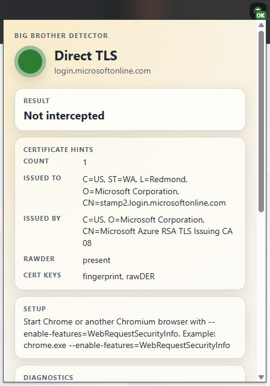
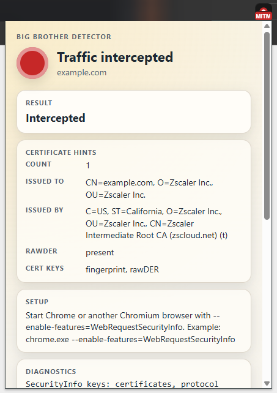

# Big Brother Detector

Author: Lubos Bretschneider  
Website: bretik.dev

Big Brother Detector detects whether HTTPS traffic is being intercepted by
Zscaler Internet Security.

## Supported browsers

- Firefox
- Google Chrome
- Microsoft Edge
- Chromium
- Brave

The Chromium-based browsers all use the same extension package in `dist\chrome`.
Firefox uses `dist\firefox`.

## Detection modes

The extension supports these modes:

1. `Firefox built-in`
   Firefox reads certificate details through its own extension API.

2. `Chrome flag`
   Chromium-based browsers read the browser's own TLS metadata when started
   with the `WebRequestSecurityInfo` feature flag.

## Build the project

Run this from the project root:

```powershell
.\build.ps1
```

This creates:

- `dist\chrome`
- `dist\firefox`

## Create release artifacts

Run this from the project root:

```powershell
.\package.ps1
```

Required environment variables:

- `AMO_JWT_ISSUER`
- `AMO_JWT_SECRET`

Optional:

- `-SkipAmoConnectivityCheck`
  Skips the PowerShell preflight request to addons.mozilla.org and goes straight
  to `web-ext sign`. This is useful on locked-down corporate machines where the
  preflight check is noisy or unreliable.

## Install in Firefox

### Unpacked extension

1. Open Firefox.
2. Go to `about:debugging`.
3. Open `This Firefox`.
4. Click `Load Temporary Add-on`.
5. Select `dist\firefox\manifest.json` from your local clone of this repository.

Firefox will use the built-in detection mode automatically.

### Packed extension

Use the signed `.xpi` package from `artifacts`, for example:

- `artifacts\big-brother-detector-firefox-v0.1.0.xpi`

You can open the `.xpi` file in Firefox, or drag it into a Firefox window to install it.

## Install in Chrome, Edge, Chromium, or Brave

### Unpacked extension

1. Open the browser extensions page.
   Chrome: `chrome://extensions`
   Edge: `edge://extensions`
   Brave: `brave://extensions`
   Chromium: `chrome://extensions`
2. Turn on developer mode.
3. Click `Load unpacked`.
4. Select `dist\chrome` from your local clone of this repository.

### Packed extension

Use the Chromium zip package from `artifacts`, for example:

- `artifacts\big-brother-detector-chromium-v0.1.0.zip`

Extract the zip to a folder first, then load that extracted folder as an unpacked extension from the browser extensions page.

## Use `Chrome flag` mode

Chromium-based browsers now support only `Chrome flag` mode.

Start the browser with this flag:

```powershell
--enable-features=WebRequestSecurityInfo
```

Then:

1. reload the extension
2. open the popup
3. confirm the diagnostics say `Chrome flag mode available: yes`

If the diagnostics say `Chrome flag mode available: no`, the browser is not
exposing certificate details to the extension.

## Examples

The popup reports one of two main HTTPS outcomes:

1. `Not intercepted`
   Direct TLS connection to the site, using the site's original public certificate chain.
   
   
2. `Intercepted`
   HTTPS traffic is being re-signed by Zscaler, and the certificate issuer / subject match the configured Zscaler rules.
   
   

## What is detected

The extension checks the top-level page certificate and matches issuer and
subject values associated with Zscaler, such as:

- `Issued to: example.com / Zscaler Inc.`
- `Issued by: Zscaler Intermediate Root CA (...)`

## Troubleshooting

### `Chrome flag mode available: no`

The browser was not started with:

```powershell
--enable-features=WebRequestSecurityInfo
```

Restart the browser with the flag and reload the extension.

### Firefox shows no certificate details

Reload the temporary add-on from `dist\firefox` so the latest background page
and manifest are loaded.

### The icon or popup looks inconsistent

Reload the unpacked extension from the latest `dist` folder so the popup,
background script, and shared files all come from the same build.

